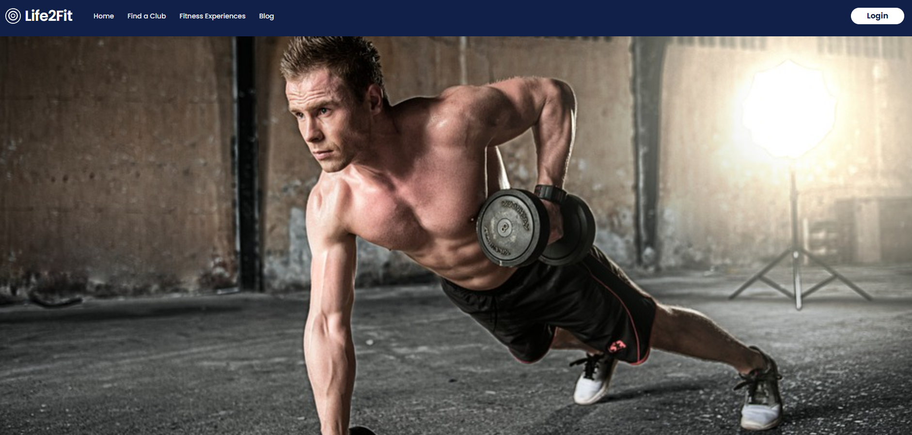
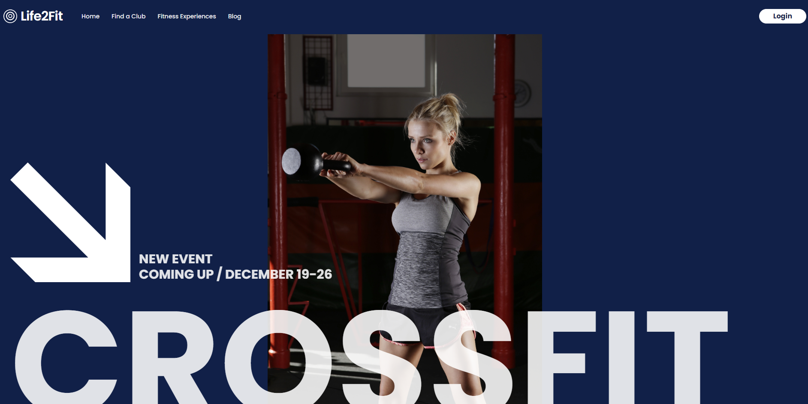
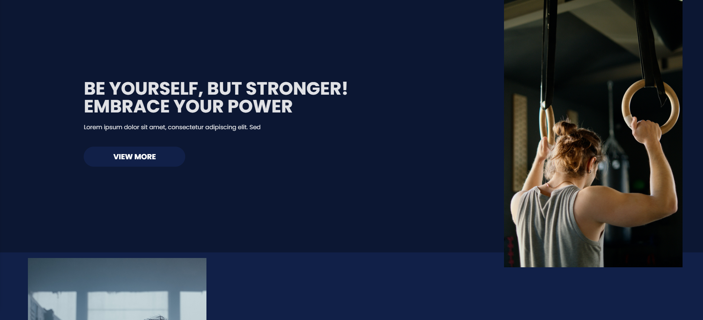
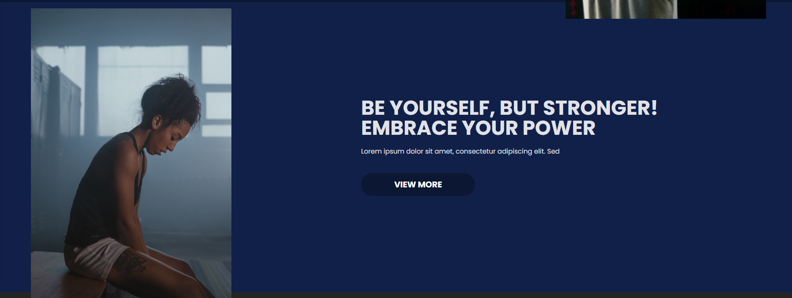
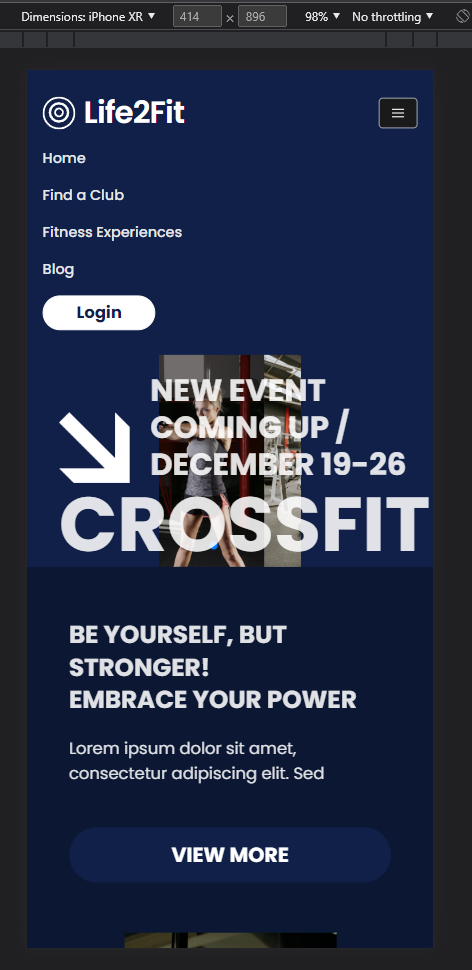
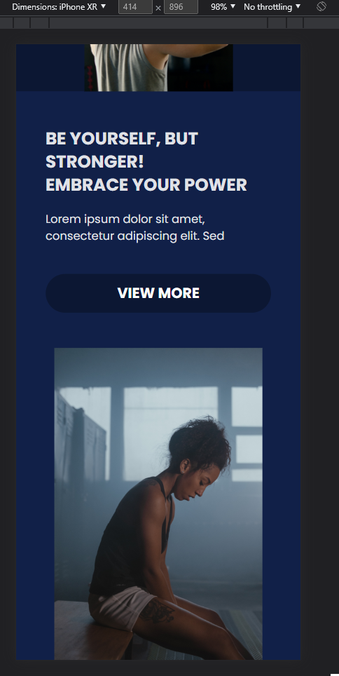
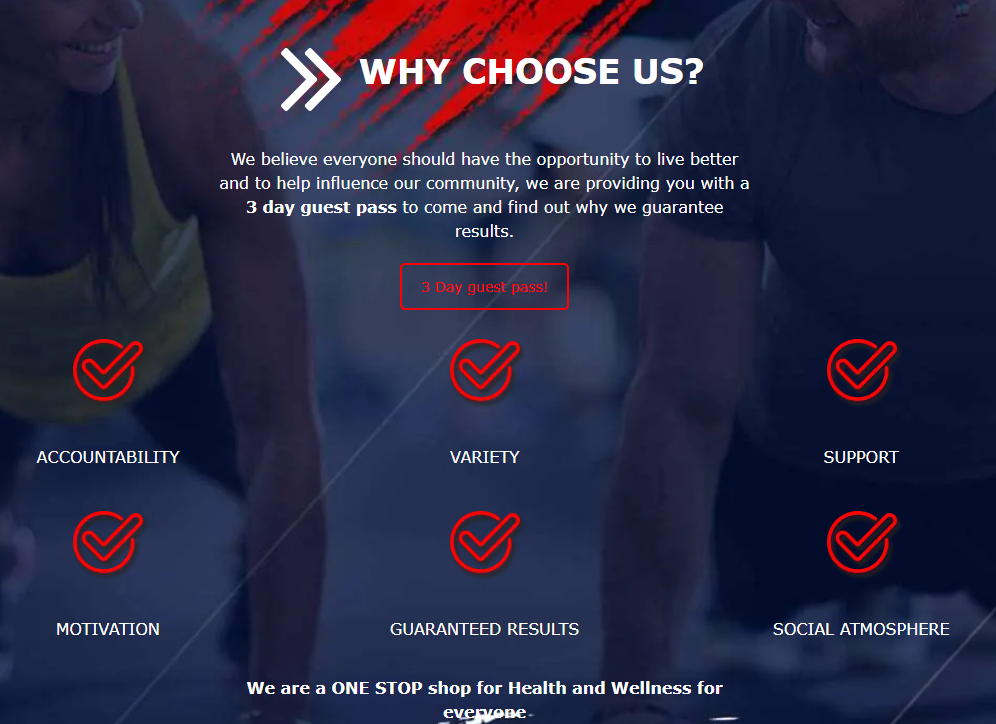

## Initial Setups

Since I have decided to make the website first, I had to decide what kind of technology I should use.

I do not want it to be a super complex for now. So, I have decided to use [React.js](https://reactjs.org/) for the frontend with [Tailwindcss](https://tailwindcss.com/) for styling.

Additionally, I have used [Vite](https://vitejs.dev/) as the build tool instead of [Create React App](https://create-react-app.dev/). I have used Vite before and I really like it. It is fast and easy to use.

I have set up the Github repository, [Gym-Landing-Page](https://github.com/Min-Ho-Lim/Gym-Landing-Page).

## The First Page

Thanks to [Tailwindcss](https://tailwindcss.com/), I was able to make the first page in a short time.
However, still this is my actually the first time using Tailwindcss. So, I had to spend some time to understand how it works.

This is the actual page I made. I used [Swiper.js](https://swiperjs.com/) for the slider. It is a very easy to use library.

But, in order to make this, it took me a quite while to do it.

First, I had to choose color palette for the page. Even though I did not like the color palette that Life4Fit uses, I feel like I have to stick with it because it is their brand.
Also, in the real world, this kind of decision is made by the UI/UX team and product owners and maybe upper-levels. So, I have to follow it.

## The Second/Third Page

Both of two next pages are simliair. So, I have made them together.
I wanted them to be simple and responsive, but it took me a while to make them because of my lack of knowledge of Tailwindcss.

## The Mobile View

Deciding the layout was not that hard, but I had to make it responsive. That was the hard part. I had to play around the width and height of the elements to make it look good.

# What's next?

1. I have to make the other pages such as "Why choose us?" for the front page section.

2. Also, I have to make the other pages such as "About us" and "Contact us" for the footer section.

# Demo

You can see the demo [https://gym-landing-page-gules.vercel.app/](https://gym-landing-page-gules.vercel.app/).
