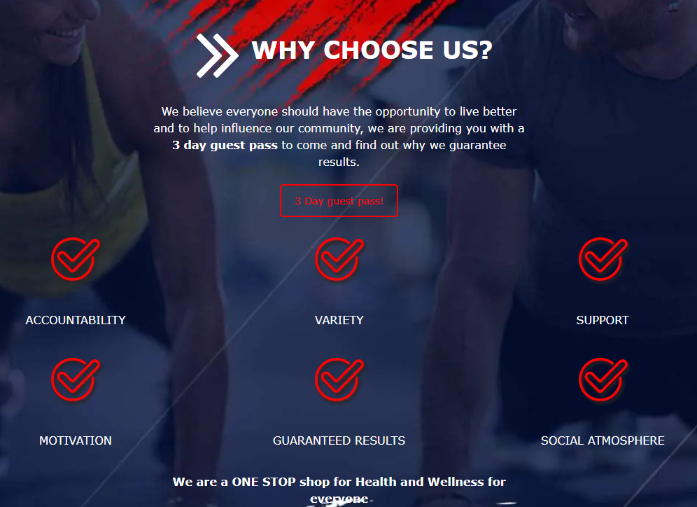
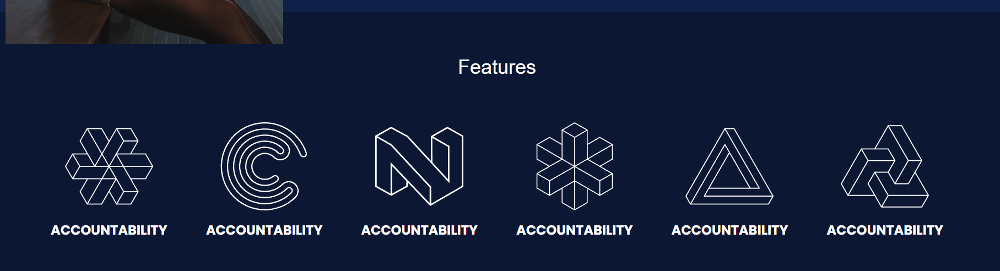
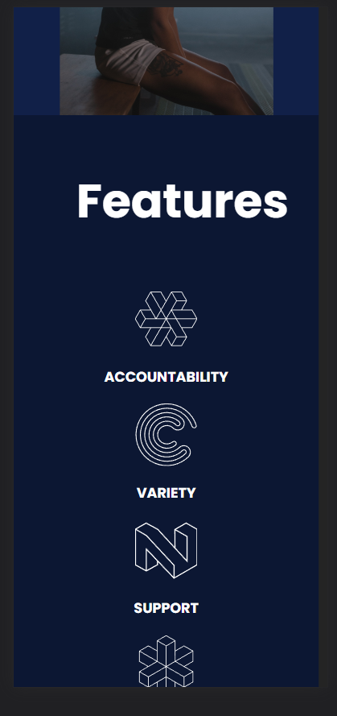
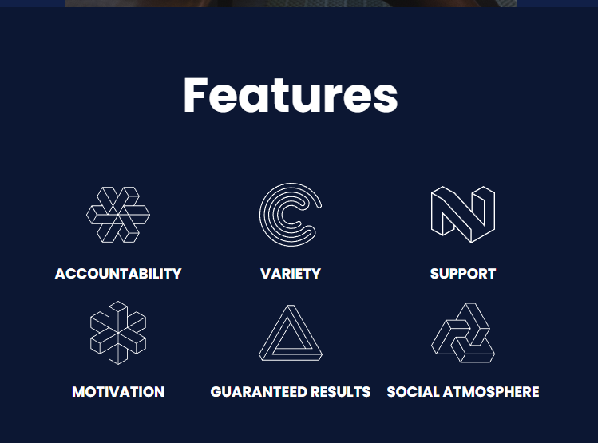
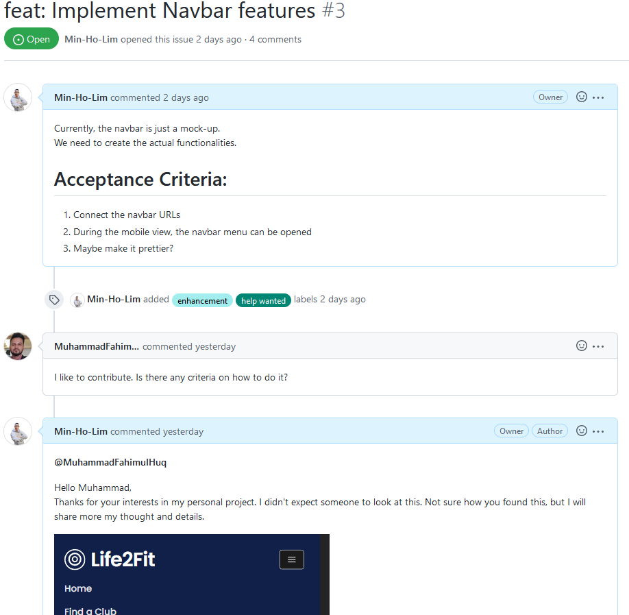
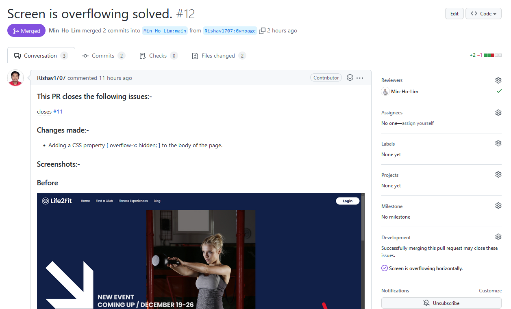
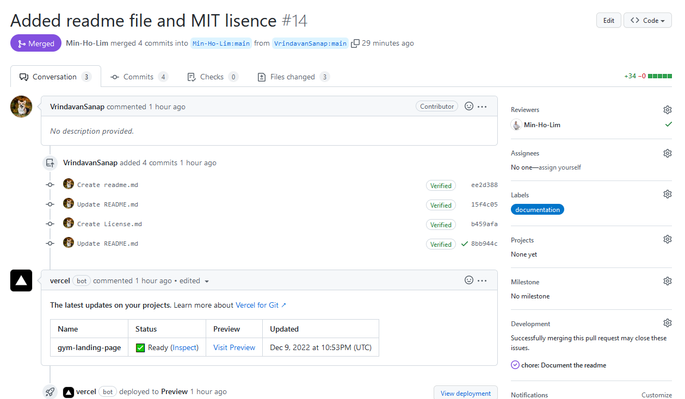
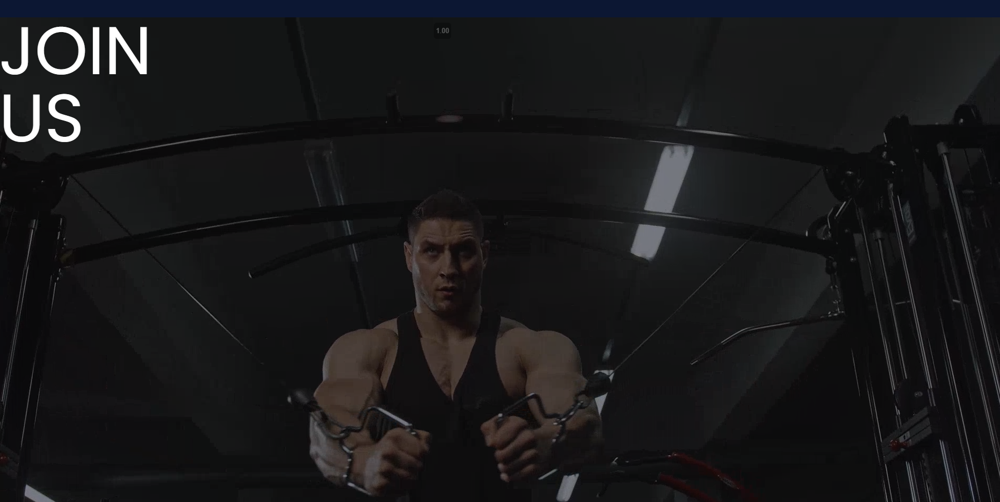

# Implementing the features section

I wanted to create a simple section that dedicates core features of the gym.

As I showed before, Life4Fit has a section that shows the core features of the gym. I wanted to create something similar.

Nothing too crazy but keep them simple. It was not that hard to achieve to do it.

The problem was responsivness.

## Responsivness

Showing mobile was another a piece of cake to do because I just need to change the flex direction to column and that's it.

But tablet was a little bit more tricky. I needed to use grid to limit the number of colums to 3 and also to make the image and the text to be in the same row.

## Contributors

Hmmm, so, apperently there are a few contributors showed up my gym Github repository.
I have no idea how do they even find my project but I'm glad they did (My best guess is Github somehow recommended my repo to them?)

Anyhow, because of their appereances, I decided to work on how to contritube and readme section of my project.

# What's next?

I'm planning to work on the join us section next. My plan is using a background video like https://openai.com/ did.

The image above is just a sample of what I'm planning to do.

Let's hope it works out well.
