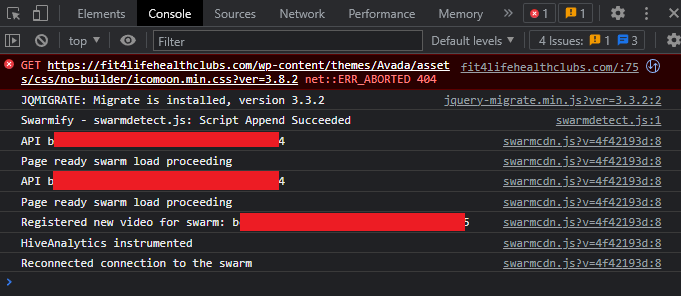

## Initial Thoughts

So, recently, I got a feeling that I want to start a new project. I have a few ideas, but I am not sure which one to choose.

I was not sure about what kind of projects should I start. Maybe like others, should I do TODO list? Or maybe a calculator? Or maybe a game? I was not sure.
While I was doing working out in my local gym a few days ago, one idea popped in my mind. I know this could be a project idea.

My local gym requires the QR code to check in, so every time I go to the gym, I need to open up their app to scan the QR code.
The app itself is quite... bad looking and missing a lot of features. I was thinking, why not I make a better app for my local gym? I can make it better looking, and I can add some features that they don't have.

So, I decided to check on their website as well.

Well, not a suprise. Their website looks terrible enough.

Maybe, you think "Oh, this is not _THAT_ bad"

It gets worse and worse if you scroll down more. I don't even know why do they choose to use a low resolution image as their background.
And, the color schema looks like it is from 2000s.

And, they even have debugging consoles in their website. I am not sure if this is intentional or not, but it is still a bad practice.
They are exposing their APIs to the public, and I can see what kind of libraries they are using.

## The Plan

So, my goals for this project is

1. Make a better looking landing page for my local gym
2. Make a better looking app for my local gym
   - Add features that they don't have
3. Create a dashboard for the website users
4. Integrate above items with tech stacks to make them actually functional

I am not sure if I can finish all of them, but I will try my best.
