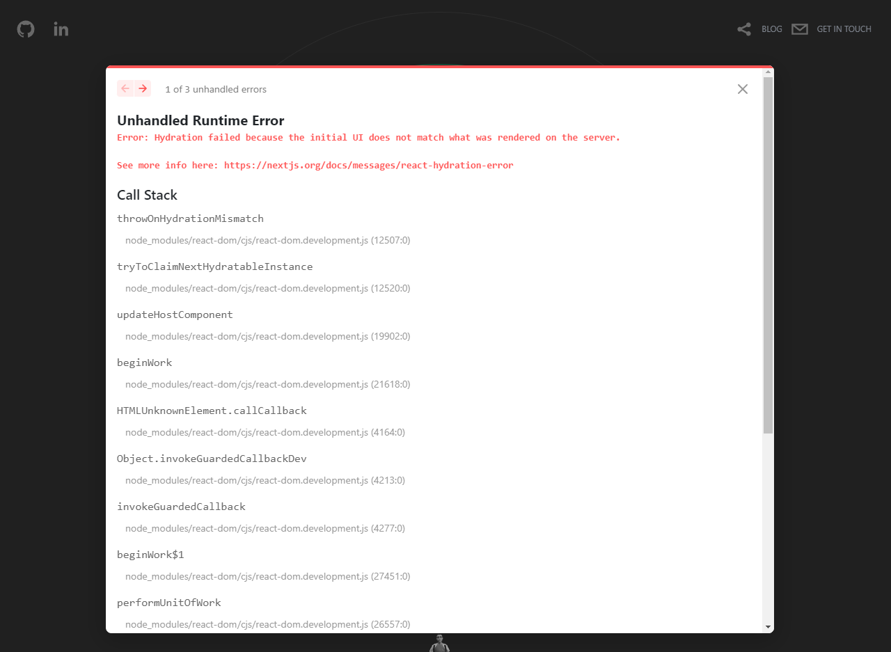
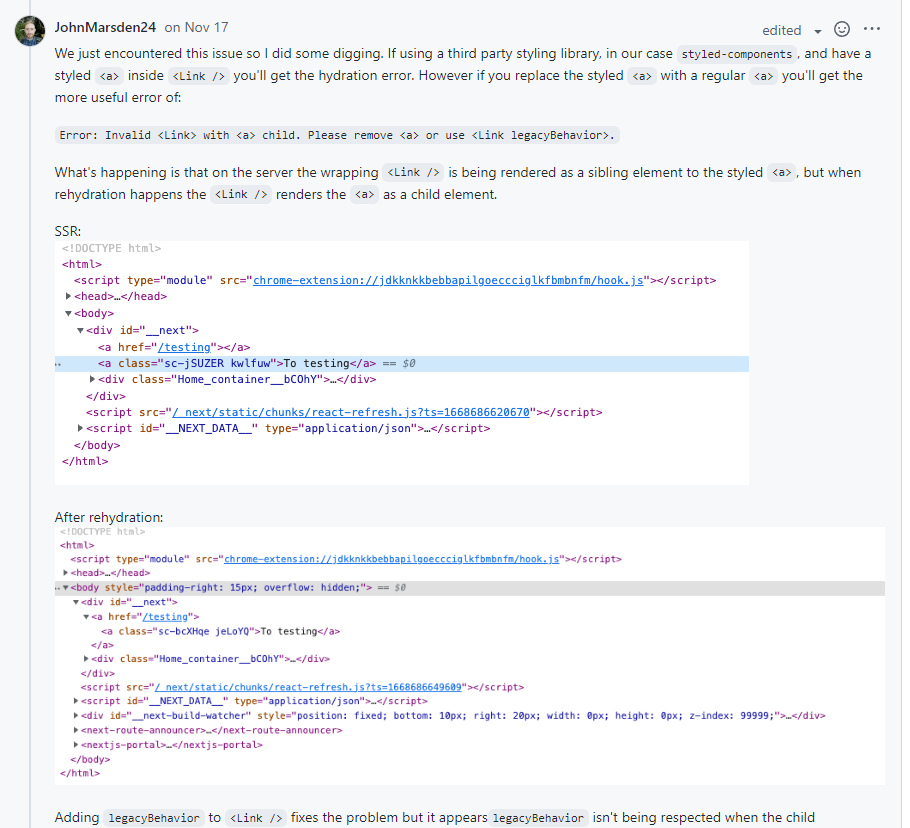
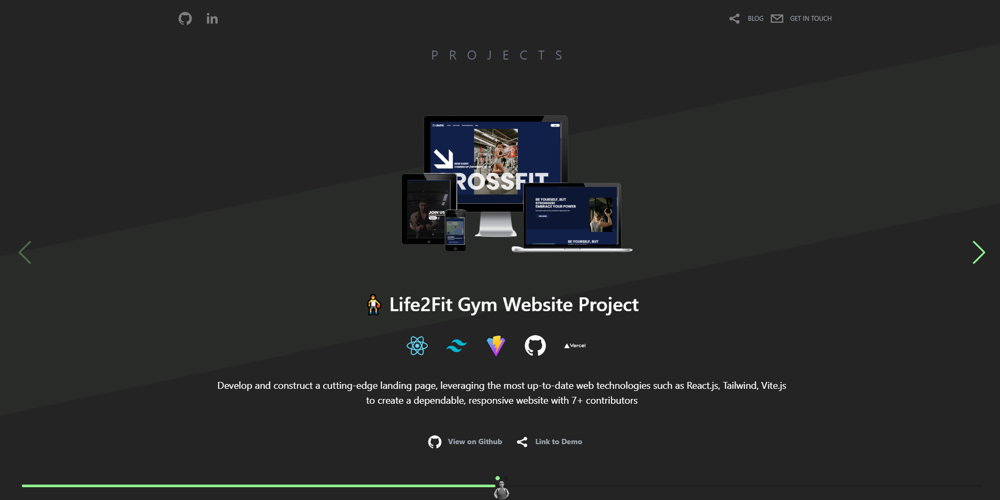

I was working on my Portfolio project and I was getting this error:



```
ERROR: Hydration failed because the initial UI does not match what was rendered on the server
```

This is unsual because I opened up the project as I left last time. And, the production deployed in Vercel is working fine.

So, I thought it might be left-over caches distruts my local development. I tried to clear the cache and restart the server. But, it didn't work.

Then, I tried to restart my computer. It didn't work either.

As like other software engineer, I googled the problem.

I found this [issue](https://github.com/vercel/next.js/discussions/35773).



While I was reading the comments, I found an intereseting [comment](https://github.com/vercel/next.js/discussions/35773#discussioncomment-4166807).

So, basically the problem is that any `<a>` tag in `next/link` causes the potential error.

```js
<div className="flex justify-center gap-3">
  <a href={github}>
    <div className="hover:scale-110 transform transition duration-200">
      <SocialIcon
        network="github"
        fgColor="white"
        bgColor="transparent"
        className="cursor-pointer"
      />
      <p className="font-bold hidden text-sm text-gray-400 md:inline-flex cursor-pointer">
        View on Github
      </p>
    </div>
  </a>
  <a href={demo}>
    <div className="hover:scale-110 transform transition duration-200">
      <SocialIcon
        fgColor="white"
        bgColor="transparent"
        className="cursor-pointer"
      />
      <p className="font-bold hidden text-sm text-gray-400 md:inline-flex cursor-pointer">
        Link to Demo
      </p>
    </div>
  </a>
</div>
```

After I digged the problem, I found that this code above causes the problem, but I did not use any `<a>` tag in `next/link` in my project.

But, after I tested some cases, if I have `<SocialIcon/>` component in the code, it causes the problem.

```js
<div className="flex justify-center gap-3">
  <span className="hover:scale-110 transform transition duration-200">
    <SocialIcon
      network="github"
      fgColor="white"
      bgColor="transparent"
      className="cursor-pointer"
      url={github}
    />

    <a
      href={github}
      className="font-bold hidden text-sm text-gray-400 md:inline-flex"
    >
      View on Github
    </a>
  </span>
  <span className="hover:scale-110 transform transition duration-200">
    <SocialIcon
      fgColor="white"
      bgColor="transparent"
      className="cursor-pointer"
      url={demo}
    />

    <a
      href={demo}
      className="font-bold hidden text-sm text-gray-400 md:inline-flex"
    >
      Link to Demo
    </a>
  </span>
</div>
```

I changed my codes like above and it worked.


Hopefully, this helps someone who is struggling with the same problem.
